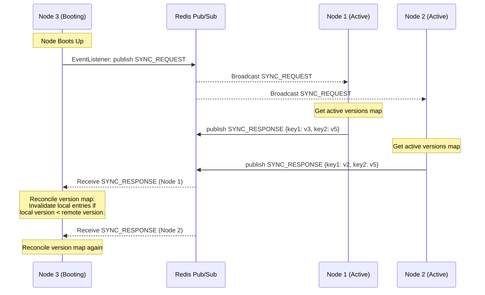
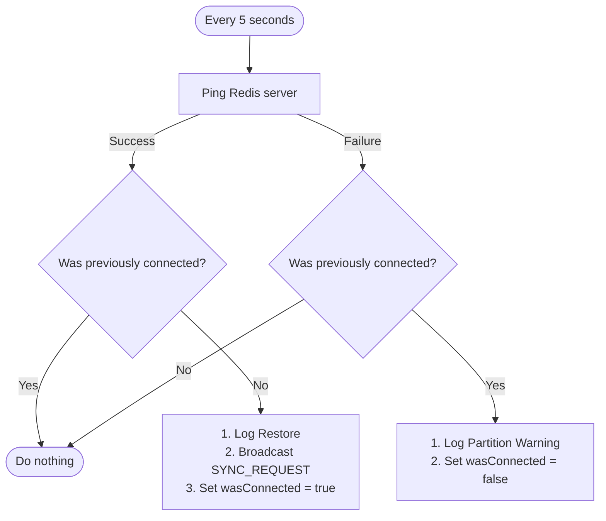

# Distributed MESI Cache Coherency Engine

A high-performance, distributed cache coherency engine implementing a software-level **MESI (Modified, Exclusive, Shared, Invalid) Protocol** across Dockerized Spring Boot cache nodes, synchronized in real-time via Redis Pub/Sub.

This cache engine guarantees strong consistency across distributed nodes under concurrent workloads, node crashes, and network partitions by incorporating global logical clocks (versioning), cold-startup recovery sync, and network partition healing.

---

## 1. System Architecture

The cluster consists of multiple independent cache nodes and a central Redis instance serving as both the Pub/Sub broker and the backing database:

```
                  +-----------------------------------+
                  |        Redis (Port 6381)          |
                  |  - Pub/Sub Topic: cache-events    |
                  |  - Backing Store: Hash cache-data |
                  |  - Global Clock:  global-version  |
                  +-----------------+-----------------+
                                    |
            +-----------------------+-----------------------+
            |                       |                       |
+-----------+-----------+   +-------+-----------+   +-----------+-----------+
| Cache Node 1 (8080)   |   | Cache Node 2 (8081)   |   | Cache Node 3 (8082)   |
| - Local Memory Cache  |   | - Local Memory Cache  |   | - Local Memory Cache  |
| - Connection Watchdog |   | - Connection Watchdog |   | - Connection Watchdog |
+-----------------------+   +-----------------------+   +-----------------------+
```

### Core Components
* **MESI State Machine ([CacheService.java](src/main/java/com/sandeep/cache_node/service/CacheService.java))**: Handles the caching state transitions (`MODIFIED`, `EXCLUSIVE`, `SHARED`, `INVALID`) for read/write requests.
* **Pub/Sub Sync ([CacheEventPublisher.java](src/main/java/com/sandeep/cache_node/service/CacheEventPublisher.java) & [CacheEventSubscriber.java](src/main/java/com/sandeep/cache_node/service/CacheEventSubscriber.java))**: Broadcasts invalidations and data transfers across the cluster on the `cache-events` topic.
* **Global Logical Clock ([VersionService.java](src/main/java/com/sandeep/cache_node/service/VersionService.java))**: Generates monotonic sequential versions using a shared Redis counter (`global-version`).
* **Connection Watchdog ([RecoveryService.java](src/main/java/com/sandeep/cache_node/service/RecoveryService.java))**: Performs periodic resource-safe checks to detect network partitions and orchestrate healing.
* **Write-Through Database ([BackingStoreService.java](src/main/java/com/sandeep/cache_node/service/BackingStoreService.java))**: Backs the cluster with persistent storage inside a Redis Hash (`cache-data`).

---

## 2. MESI State Transitions

Each key in a node's local cache transitions through the following states:

| Current State | Event | Next State | Action / Network Messages |
| :--- | :--- | :--- | :--- |
| **INVALID** / **Miss** | Local Read | **SHARED** (Remote hit)<br>**EXCLUSIVE** (DB hit) | Broadcasts `READ_REQUEST`. Blocks for remote response. If timed out, loads from DB and sets to EXCLUSIVE. |
| **INVALID** / **Miss** | Local Write | **MODIFIED** | Broadcasts `WRITE_REQUEST` (invalidation) and writes to backing database. |
| **SHARED** | Local Read | **SHARED** | Cache Hit. Returns value immediately. |
| **SHARED** | Local Write | **MODIFIED** | Broadcasts `WRITE_REQUEST` (invalidation), updates locally, and writes to backing database. |
| **SHARED** | Remote Read | **SHARED** | Responds with `DATA_RESPONSE` containing the value and version. |
| **SHARED** | Remote Write | **INVALID** | Invalidates local entry. |
| **EXCLUSIVE** | Local Read | **EXCLUSIVE** | Cache Hit. Returns value immediately. |
| **EXCLUSIVE** | Local Write | **MODIFIED** | Updates local entry. No network message needed (exclusive owner). |
| **EXCLUSIVE** | Remote Read | **SHARED** | Flushes value to DB, transitions to SHARED, and responds with `DATA_RESPONSE`. |
| **EXCLUSIVE** | Remote Write | **INVALID** | Invalidates local entry. |
| **MODIFIED** | Local Read | **MODIFIED** | Cache Hit. Returns dirty value immediately. |
| **MODIFIED** | Local Write | **MODIFIED** | Updates local entry and increments version. |
| **MODIFIED** | Remote Read | **SHARED** | Flushes value to DB, transitions to SHARED, and responds with `DATA_RESPONSE`. |
| **MODIFIED** | Remote Write | **INVALID** | Flushes dirty value to DB, invalidates local entry. |

---

## 3. Recovery & Partition Healing Protocols

## 1. Core Scenarios Solved

Your caching engine must maintain **strong cache consistency**. This becomes difficult under two main circumstances:

1. **Cold Startup**: A node crashes or restarts. While it was offline, other active nodes might have written newer data. If the restarting node simply loads values from the backing database without checking, it could read stale values.
2. **Network Partition (Split-brain)**: A node loses network connectivity to Redis. Since Redis Pub/Sub is fire-and-forget, the disconnected node misses all invalidation events (`WRITE_REQUEST`) sent during the partition. When the network heals, it still has stale data in its memory.

---

## 2. Cold Startup Recovery

When a node starts up, its memory is empty (or has legacy entries). It must reconcile its state before serving requests safely.

### The Lifecycle Flow



### Implementation Details

#### Step A: Detecting Startup & Requesting Sync
In [RecoveryService.java](file:///home/sandeep/cache-node/src/main/java/com/sandeep/cache_node/service/RecoveryService.java), the `@EventListener(ApplicationReadyEvent.class)` triggers as soon as the Spring Boot application is fully up and running:

```java
@EventListener(ApplicationReadyEvent.class)
public void onStartup() {
    System.out.println("[RECOVERY] Node started, broadcasting SYNC_REQUEST...");
    try {
        publisher.publishSyncRequest();
    } catch (Exception e) {
        System.err.println("[RECOVERY STARTUP ERR] Redis offline, will retry via monitor: " + e.getMessage());
        wasConnected = false;
    }
}
```

#### Step B: Active Nodes Receive Request & Send Version Map
In [CacheEventSubscriber.java](file:///home/sandeep/cache-node/src/main/java/com/sandeep/cache_node/service/CacheEventSubscriber.java), when other nodes receive a `SYNC_REQUEST`:

```java
case SYNC_REQUEST:
    System.out.println("[RECV SYNC_REQUEST from " + event.getSenderId() + "]");
    Map<String, Long> activeVersions = cacheService.getActiveVersions();
    publisher.publishSyncResponse(activeVersions);
    break;
```

In [CacheService.java](file:///home/sandeep/cache-node/src/main/java/com/sandeep/cache_node/service/CacheService.java), `getActiveVersions()` filters out any invalid entries and returns only active key-version mappings:

```java
public Map<String, Long> getActiveVersions() {
    Map<String, Long> active = new HashMap<>();
    cache.forEach((key, entry) -> {
        if (entry.getState() != CacheState.INVALID) {
            active.put(key, entry.getVersion());
        }
    });
    return active;
}
```

#### Step C: The Recovering Node Receives response & Reconciles
When the recovering node receives a `SYNC_RESPONSE`, it parses the version map and calls `handleSyncResponse` in `CacheService`:

```java
case SYNC_RESPONSE:
    System.out.println("[RECV SYNC_RESPONSE from " + event.getSenderId() + "]");
    try {
        Map<String, Object> rawMap = mapper.readValue(event.getValue(), Map.class);
        Map<String, Long> remoteVersions = new HashMap<>();
        rawMap.forEach((k, v) -> {
            if (v instanceof Number num) {
                remoteVersions.put(k, num.longValue());
            }
        });
        cacheService.handleSyncResponse(remoteVersions);
    } catch (Exception e) {
        System.err.println("[SUBSCRIBER SYNC RECONCILE ERR] " + e.getMessage());
    }
    break;
```

Inside [CacheService.java](file:///home/sandeep/cache-node/src/main/java/com/sandeep/cache_node/service/CacheService.java):
```java
public void handleSyncResponse(Map<String, Long> remoteVersions) {
    remoteVersions.forEach((key, remoteVersion) -> {
        CacheEntry localEntry = cache.get(key);
        if (localEntry != null && localEntry.getState() != CacheState.INVALID) {
            // Reconcile: If my local cache version is older than what the cluster has, invalidate!
            if (localEntry.getVersion() < remoteVersion) {
                System.out.println("[HEAL INVALIDATE] key=" + key 
                                   + " local=" + localEntry.getVersion() 
                                   + " remote=" + remoteVersion);
                localEntry.setState(CacheState.INVALID);
                latestVersions.put(key, remoteVersion);
            }
        }
    });
}
```

---

## 3. Network Partition Healing (Split-Brain)

If a node gets disconnected from the network, it enters a state of isolation. During isolation:
1. It cannot receive Pub/Sub messages (so it misses `WRITE_REQUEST` updates from other nodes).
2. It can still serve local cache hits (`EXCLUSIVE`, `SHARED`, or `MODIFIED`) if the keys are in memory, because going to the database or Redis will fail.

### The Connection Watchdog

The watchdog is implemented in [RecoveryService.java](file:///home/sandeep/cache-node/src/main/java/com/sandeep/cache_node/service/RecoveryService.java) using a scheduled loop running every 5 seconds.



### Implementation of the Watchdog

Here is how [RecoveryService.java](file:///home/sandeep/cache-node/src/main/java/com/sandeep/cache_node/service/RecoveryService.java) implements this loop:

```java
@Scheduled(fixedRate = 5000)
public void checkConnection() {
    boolean currentlyConnected = false;
    
    // Resource-safe check (try-with-resources prevents connection pool leaks)
    try (var connection = redisTemplate.getConnectionFactory().getConnection()) {
        connection.ping();
        currentlyConnected = true;
    } catch (Exception e) {
        currentlyConnected = false;
    }

    // State Transition: RESTORED (Healing)
    if (currentlyConnected && !wasConnected) {
        System.out.println("[HEAL] Connection to Redis restored! Triggering SYNC_REQUEST...");
        try {
            publisher.publishSyncRequest();
            wasConnected = true;
        } catch (Exception e) {
            System.err.println("[HEAL ERR] Failed to publish sync request: " + e.getMessage());
        }
    } 
    // State Transition: DISCONNECTED (Partitioned)
    else if (!currentlyConnected && wasConnected) {
        System.err.println("[PARTITION DETECTED] Lost connection to Redis! Local hits will remain active.");
        wasConnected = false;
    }
}
```

### Why it triggers `SYNC_REQUEST` on reconnect:
Since the node was disconnected, it has missed several `WRITE_REQUEST` messages. When it pings successfully again, it triggers a `SYNC_REQUEST` to prompt all other active nodes to publish their version maps. The healed node then runs the reconciliation in `handleSyncResponse` to invalidate any local key whose version is outdated.

---

## 4. Key Strengths of this Design

1. **Active Peer Reconciliation**: Nodes do not rely on a central server to know what was missed. They query their peers directly, ensuring the cluster establishes a consensus.
2. **Resource-Safe Watchdog**: Using `try-with-resources` to ping Redis ensures that failed connection attempts do not exhaust the client connection pool, which would lock up the Spring Boot app.
3. **Graceful Degradation**: If Redis goes down, the nodes do not crash; they log warning statements and continue serving local reads from memory (Local hits remain active) while trying to heal.

## 4. Verified Test Suite (3-Step Validation)

We have verified the cache coherency engine using a 3-step testing protocol simulating writes, cold bootups, and network partitions.

### Step 1: Basic Propagation (MESI Coherence)
**Command**: Store key `color` = `"red"` on Node 1, and read it from Node 2 & Node 3:
```bash
# 1. Put key 'color' on Node 1
curl -s -X PUT -H "Content-Type: application/json" -d '{"value":"red"}' http://localhost:8080/cache/color

# 2. Get key 'color' from Node 2 & 3
curl -s http://localhost:8081/cache/color
curl -s http://localhost:8082/cache/color

# 3. Check states on all nodes
curl -s http://localhost:8080/cache/states
curl -s http://localhost:8081/cache/states
curl -s http://localhost:8082/cache/states
```
**Output**:
```
Stored
red
red
{"color":"SHARED"}
{"color":"SHARED"}
{"color":"SHARED"}
```
*Verification: The write on Node 1 successfully triggered a cache-to-cache transfer to Node 2 and Node 3, transitioning all nodes to `SHARED` state.*

---

### Step 2: Cold Startup Recovery
**Command**: Store `vehicle` = `"car"` on Node 1, stop Node 3, update `vehicle` = `"bike"` on Node 1, restart Node 3:
```bash
# 1. Put key 'vehicle' on Node 1
curl -s -X PUT -H "Content-Type: application/json" -d '{"value":"car"}' http://localhost:8080/cache/vehicle

# 2. Stop Node 3 to simulate crash
docker compose stop cache-node-3

# 3. Update 'vehicle' to 'bike' on Node 1 (Node 3 is offline, missing the invalidation)
curl -s -X PUT -H "Content-Type: application/json" -d '{"value":"bike"}' http://localhost:8080/cache/vehicle

# 4. Restart Node 3
docker compose start cache-node-3
sleep 4

# 5. Read 'vehicle' and its entry status from Node 3
curl -s http://localhost:8082/cache/vehicle
curl -s http://localhost:8082/cache/entry/vehicle
```
**Output**:
```
Stored
[+] Stopping 1/1
 ✔ Container cache-node-cache-node-3-1  Stopped
Stored
[+] Running 2/2
 ✔ Container redis                      Healthy
 ✔ Container cache-node-cache-node-3-1  Started
bike
{"value":"bike","version":3,"state":"SHARED"}
```
*Verification: Upon bootup, Node 3 requested a sync, reconciled its version tracker, and successfully received the updated `"bike"` value (version 3) in `SHARED` state.*

---

### Step 3: Network Partition Healing
**Command**: Disconnect Node 1 from the network, update `vehicle` = `"plane"` on Node 2, reconnect Node 1:
```bash
# 1. Disconnect Node 1 from Docker default network
docker network disconnect cache-node_default cache-node-cache-node-1-1

# 2. Update 'vehicle' on Node 2 (Node 1 misses the invalidation because it's offline)
curl -s -X PUT -H "Content-Type: application/json" -d '{"value":"plane"}' http://localhost:8081/cache/vehicle

# 3. Reconnect Node 1 back to the network
docker network connect cache-node_default cache-node-cache-node-1-1
sleep 7

# 4. Read 'vehicle' and check state from Node 1
curl -s http://localhost:8080/cache/vehicle
curl -s http://localhost:8080/cache/entry/vehicle
```
**Output**:
```
Stored
plane
{"value":"plane","version":4,"state":"SHARED"}
```
*Verification: RecoveryService on Node 1 detected the network reconnect after the partition healed, broadcasted a SYNC_REQUEST, invalidated its local stale entry ("bike"), and successfully fetched the new value "plane" (version 4) on the next read.*

---

## 5. How to Run Locally

### Requirements
* Docker and Docker Compose
* JDK 21 and Maven (to build outside Docker)

### Build & Run the Cluster
Run the following command in the project root to compile the applications and start the cluster:
```bash
docker compose up -d --build
```
This starts 3 cache nodes and 1 Redis instance. You can query each node at:
* Node 1: `http://localhost:8080/cache`
* Node 2: `http://localhost:8081/cache`
* Node 3: `http://localhost:8082/cache`
* Redis: `localhost:6381`
